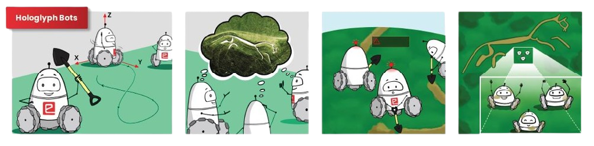
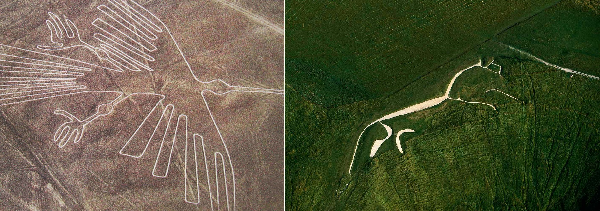

# Hologlyph Bots - Swarm of 3 Drawing Robots

<p align="center">
  
</p>

## Introduction

In the heart of a lush Greenland landscape, a perplexing enigma etched itself into the Earth's surface thousands of years ago. The Nasca Lines, colossal geoglyphs spanning vast stretches of green land, have confounded archaeologists and historians for centuries. These monumental creations – intricate animal figures, geometric designs, and intricate shapes – remain a testament to a civilization long past. Yet, their true purpose and the methods behind their construction continue to elude us.

Were the Nasca Lines celestial calendars, guiding the ancient Nasca people in their agricultural endeavors? Were they sacred pathways for religious rituals? Or did they serve as messages for extraterrestrial beings 👽? Theories abound, yet the mystery remains, challenging our understanding of ancient cultures and their relationship with the cosmos.

<p align="center">
  
  <br>
  <b>Geoglyphs</b>
</p>

## Table of Contents

- [Introduction](#introduction)
- [Supported Operating System](#supported-operating-system)
- [Prerequisites](#prerequisites)
- [Installation](#installation)
- [Stage 1 - Simulation Tasks](#stage-1---simulation-tasks)
  - [Usage - Task 1A - Snowman Task - ROS2 Turtlesim Control](#usage---task-1a---snowman-task---ros2-turtlesim-control)
  - [Usage - Task 1B - Geometry Shapes w/o Inverse Kinematics](#usage---task-1b---geometry-shapes-wo-inverse-kinematics)

## Supported Operating System

The project is currently designed and tested for **Linux-based** operating systems. For optimal compatibility and performance, it is recommended to use **_Ubuntu_**. The project has been thoroughly tested and built on the Ubuntu platform.

## Prerequisites

To ensure a smooth installation process, please verify the following prerequisites:

1. **Docker Installation:** Ensure Docker is installed on your local machine. For installation instructions, refer to the official [Docker documentation](https://docs.docker.com/engine/install/ubuntu/).

2. **Docker Images:** Make sure the following Docker images are available on your local machine:

   - **osrf/ros:humble-desktop**
   - **microros/micro-ros-agent:humble**

By meeting these prerequisites, you will be prepared for a seamless installation experience.

## Installation

To install and set up the project on your local machine, run the following commands in your terminal:

```bash
# Clone the Repository
git clone

# Navigate to the Project Directory
cd

# Build Docker Image for Hologlyph Bots
docker build -t hologlyph_bots:latest .
```

## Stage 1 - Simulation Tasks

### 1. Usage - Task 1A - Snowman Task - ROS2 Turtlesim Control

To utilize this task, follow these steps:

```bash
# Set up X11 Forwarding:
xhost + local:docker

# Start Docker Container:
docker-compose up

# Enter Container and Execute Commands:

# Terminal 1: Run turtlesim node
ros2 run turtlesim turtlesim_node

# Terminal 2: Run task_1a_2977 node
ros2 run hb_task_1a task_1a_2977
```

- ### Task 1A Demonstration Video

  Watch our demonstration video on YouTube.

  [](https://www.youtube.com/watch?v=QnQcQXxr6Do)

### 2. Usage - Task 1B - Geometry Shapes w/o Inverse Kinematics

To utilize this task, follow these steps:

```bash
# Set up X11 Forwarding:
xhost + local:docker

# Start Docker Container:
docker-compose up

# Enter Container and Execute Commands:

# Terminal 1: Run Gazebo World World
ros2 launch hb_task_1b gazebo.launch.py

# Terminal 2: Run Task 1B Controller
ros2 launch hb_task_1b hb_task1b.launch.py
```

- ### Task 1B Demonstration Video

  Watch our demonstration video on YouTube.

  [](https://www.youtube.com/watch?v=8ZF3gBc3V2g)

### 3. Usage - Task 2A - Geometry Shapes with Inverse Kinematics on 1 Robot

To utilize this task, follow these steps:

```bash
# Set up X11 Forwarding:
xhost + local:docker

# Start Docker Container:
docker-compose up

# Enter Container and Execute Commands:

# Terminal 1: Run Gazebo World World
ros2 launch hb_task2a task2a.launch.py

# Terminal 2: Run Task 2A Controller
ros2 launch hb_task2a controller.launch.py
```

- ### Task 2A Demonstration Video

  Watch our demonstration video on YouTube.

  [](https://www.youtube.com/watch?v=paUe7M75cco)

### 4. Usage - Task 2B - Geometry Shapes with Inverse Kinematics on 3 Robot

To utilize this task, follow these steps:

```bash
# Set up X11 Forwarding:
xhost + local:docker

# Start Docker Container:
docker-compose up

# Enter Container and Execute Commands:

# Terminal 1: Run Gazebo World World
ros2 launch hb_task2b task2b.launch.py

# Terminal 2: Run Task 2B Controller
ros2 launch hb_task2b controller.launch.py
```

- ### Task 2B Demonstration Video

  Watch our demonstration video on YouTube.

  [](https://www.youtube.com/watch?v=s0FCmrMWIJs)

## Stage 2 - Hardware Tasks

### 1. Task 3 - Hardware Testing

This task involves hardware testing and areana priniting

- ### Task 3 Demonstration Video

  Watch our demonstration video on YouTube.

  [](https://www.youtube.com/watch?v=l0fRnb-LPFk)

### 2. Task 4A - Bot Fabrication and Test Run

- ### Task 4A Demonstration Video

  Watch our demonstration video on YouTube.

  [](https://www.youtube.com/watch?v=LkYmiV9doJM)

### 3. Task 4B - Camera Calibaration and Feedback Node

Raw image from the USB camera has what is known as the fish-eye effect. We need to remove this fish-eye effect to effectively detect Aruco markers in further tasks. Hence it is necessary to calibrate our USB camera.

- **Callibrate:** Follow up these commands to get xml file for camera parameters which will be used to restore the distored image through fisheye camera.

_**Note:**_ _Before starting the callibration replace the contents of_ **/opt/ros/humble/share/usb_cam/config/params_1.yaml** _to the following yaml code block:_

```yaml
/**:
  ros__parameters:
    video_device: "/dev/video2"
    framerate: 30.0
    io_method: "mmap"
    frame_id: "camera"
    pixel_format: "yuyv2rgb" # see usb_cam/supported_formats for list of supported formats
    av_device_format: "YUV422P"
    image_width: 640
    image_height: 480
    camera_name: "narrow_stereo"
    camera_info_url: "package://usb_cam/config/camera_info.yaml"
    brightness: -1
    contrast: -1
    saturation: -1
    sharpness: -1
    gain: -1
    auto_white_balance: true
    white_balance: 4000
    autoexposure: true
    exposure: 100
    autofocus: false
    focus: -1
```

_**Note:**_ _Before starting the camera replace the contents of_ **/opt/ros/humble/share/usb_cam/launch/camera_config.py** _to the following code block:_

```python
from pathlib import Path
from typing import List, Optional

from ament_index_python.packages import get_package_share_directory
from pydantic import BaseModel, root_validator, validator

USB_CAM_DIR = get_package_share_directory('usb_cam')


class CameraConfig(BaseModel):
    name: str = 'camera1'
    param_path: Path = Path(USB_CAM_DIR, 'config', 'params_1.yaml')
    remappings: Optional[List]
    namespace: Optional[str]

    @validator('param_path')
    def validate_param_path(cls, value):
        if value and not value.exists():
            raise FileNotFoundError(f'Could not find parameter file: {value}')
        return value

    @root_validator
    def validate_root(cls, values):
        name = values.get('name')
        remappings = values.get('remappings')
        if name and not remappings:
            # Automatically set remappings if name is set
            remappings = [
                ('image_raw', '/image_raw'),
                ('image_raw/compressed', '/image_compressed'),
                ('image_raw/compressedDepth', '/compressedDepth'),
                ('image_raw/theora', '/image_raw/theora'),
                ('camera_info', '/camera_info'),
            ]
        values['remappings'] = remappings
        return values
```

Now Start Callibration:

```bash
# Set up X11 Forwarding:
xhost + local:docker

# Start Docker Container:
docker-compose up

# Start the Camera Node, You should see /camera1/image_raw and /camera1/camera_info when you run ros2 topic list
ros2 launch usb_cam camera.launch.py

# Open Callibration Tool
ros2 run camera_calibration cameracalibrator --size 8x6 --square 0.02 --ros-args -r image:=/camera/image_raw -p camera:=/camera
```

_**Note:**_ _Replace the contents of_ **/opt/ros/humble/share/usb_cam/config/camera_info.yaml** _with the new config file we recieved from callibration tool._

### Undistort the Fisheye Image

```bash
# Start Camera
ros2 launch usb_cam camera.launch.py

# Undistort Image
ros2 launch image_proc image_proc.launch.py
```

- ### Task 4B Demonstration Video

  Watch our demonstration video on YouTube.

  [](https://www.youtube.com/watch?v=u3AG3T7k_cs)

### 4. Task 4C - Open Loop Control
```bash
# Run Micro Ros Agent from docker
docker run -it --rm -v /dev:/dev --privileged --net=host microros/micro-ros-agent:humble udp4 --port 8888

# Run Code Regarding Shapes
python3 hardware/hb_task4/task_4c__Open_Loop_Control/circle.py # Circle
python3 hardware/hb_task4/task_4c__Open_Loop_Control/sqaure.py # Square
python3 hardware/hb_task4/task_4c__Open_Loop_Control/triangle.py # Triangle
```
- ### Task 4C Demonstration Video

  Watch our demonstration video on YouTube.

  [](https://www.youtube.com/watch?v=5f4-NmnSb9Y)

### 5. Task 5A - Closed Loop Control
```bash
# Run Micro Ros Agent from docker
docker run -it --rm -v /dev:/dev --privileged --net=host microros/micro-ros-agent:humble udp4 --port 8888

# Run Camera Feedback
python3 hardware/hb_task4/task_4b__Camera_Callibration/feedback.py

# Run code for taking robots to start position
python3 hardware/hb_task5/task_5a__ReachStart.py

# Run Controller
python3 hardware/hb_task5/task_5a__ClosedLoopControl.pu
```
 - ### Task 5A Demonstration Video

  Watch our demonstration video on YouTube.

  [](https://www.youtube.com/watch?v=AE-HUOiYAfQ)

### 6. Task 5B - Mini Theme Run
```bash
# Run Micro Ros Agent from docker
docker run -it --rm -v /dev:/dev --privileged --net=host microros/micro-ros-agent:humble udp4 --port 8888

# Run Camera Feedback
python3 hardware/hb_task4/task_4b__Camera_Callibration/feedback.py

# Run code for taking robots to start position
python3 hardware/hb_task5/task_5b__ReachStart.py

# Run Controller
python3 hardware/hb_task5/task_5b__MiniThemeRun.py
```
 - ### Task 5B Demonstration Video

  Watch our demonstration video on YouTube.

  [](https://www.youtube.com/watch?v=L2WuoDtZy2Y)

### 6. Task 6A - Function Generator
```bash
# Run Micro Ros Agent from docker
docker run -it --rm -v /dev:/dev --privileged --net=host microros/micro-ros-agent:humble udp4 --port 8888

# Run Camera Feedback
python3 hardware/hb_task4/task_4b__Camera_Callibration/feedback.py

# Run code for taking robots to start position
python3 hardware/hb_task6/reachGraderStart.py

# Run Controller
python3 hardware/hb_task6/bot_controls.py
```
 - ### Task 6A Demonstration Video

  Watch our demonstration video on YouTube.

  [](https://www.youtube.com/watch?v=_6kzz_bGMEQ)

### 7. Task 6B - Image Generator
```bash
# Run Micro Ros Agent from docker
docker run -it --rm -v /dev:/dev --privileged --net=host microros/micro-ros-agent:humble udp4 --port 8888

# Run Camera Feedback
python3 hardware/hb_task4/task_4b__Camera_Callibration/feedback.py

# Run code for taking robots to start position
python3 hardware/hb_task6/reachGraderStart.py

# Run Controller
python3 hardware/hb_task6/bot_controls.py -image_mode=true
```
 - ### Task 6B Demonstration Video

  Watch our demonstration video on YouTube.

  [](https://www.youtube.com/watch?v=julvKPNEnqU)
